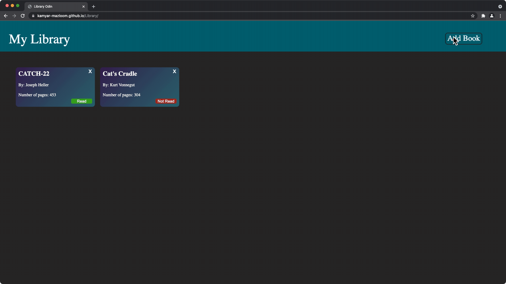

# Library

From [the Odin Project](http://www.theodinproject.com/)'s Full-Stack JS curriculum.

The goal was to learn and practice with objects, object prototypes, inheritance chains, etc. by creating a book library with the options of adding and deleting books.

The project has no back-end so the library will reset after refreshing the page.
[Live Demo](https://kamyar-mazloom.github.io/Library/) :point_left:

